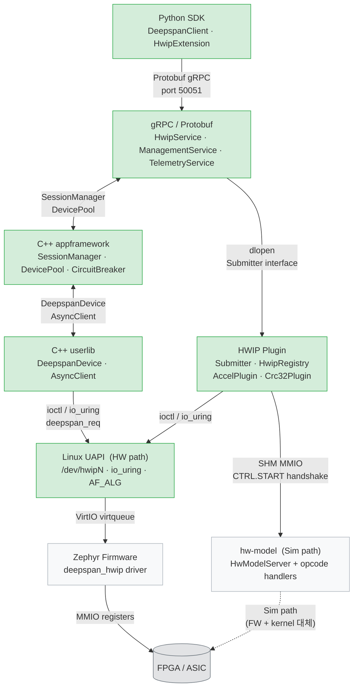

# deepspan Stable API Reference

레이어 간 인터페이스를 **하드웨어 → 애플리케이션** 순으로 정의한다.
HWIP 플러그인 작성자는 **Tier 1** 인터페이스만 의존해야 한다.

---

## 아키텍처 API 관계도



> 녹색: Tier 1 (안정 보장) — 회색: Tier 3 (내부 구현, 보장 없음)

---

## Layer 1 — Zephyr Firmware C API `[Tier 1]`

펌웨어 애플리케이션과 HWIP 드라이버 사이의 인터페이스.
헤더: `firmware/drivers/deepspan/deepspan_hwip.h`

| 함수 / 상수 | 시그니처 | 설명 |
|---|---|---|
| `deepspan_hwip_submit_cmd()` | `(dev, opcode, arg0, arg1, timeout_ms, *status, *data0, *data1) → int` | 커맨드 제출 후 완료 대기 (세마포어 블로킹) |
| `deepspan_hwip_set_dma()` | `(dev, src, len) → int` | DMA 버퍼에 데이터 기록 (Sim: SHM 0x300에 memcpy, HW: stub) |
| `deepspan_hwip_version()` | `(dev) → uint32_t` | HW_VERSION 레지스터 읽기 |
| `deepspan_hwip_sim_device()` | `(void) → const struct device *` | native_sim 싱글톤 디바이스 반환 (`CONFIG_DEEPSPAN_HWIP_DRIVER_SIM=y`만) |

**드라이버 구현체**

| 파일 | 활성 조건 | 비고 |
|---|---|---|
| `deepspan_hwip_sim.c` | `CONFIG_DEEPSPAN_HWIP_DRIVER_SIM=y` | native_sim: POSIX shm mmap + 폴링 스레드 |
| `deepspan_hwip.c` | DTS `deepspan_hwip` 노드 | 실 HW: MMIO + ISR; `set_dma` stub (`-ENOTSUP`) |

---

## Layer 2 — HWIP codegen 단일 원천 `[Tier 1 출력, Tier 3 내부]`

`hwip/<type>/hwip.yaml` 하나에서 6개 레이어 아티팩트를 동시에 생성한다.

```
hwip/<type>/hwip.yaml
    │
    ▼  deepspan-codegen --descriptor hwip.yaml --out gen/
    ├── gen/kernel/<type>.h              C헤더 (UAPI opcode 상수)            → Layer 3
    ├── gen/firmware/deepspan_<type>/    Zephyr opcode dispatch 헤더         → Layer 1
    ├── gen/sim/deepspan_<type>/ops.hpp  C++20 hw-model enum + RegOffsets    → hw-model
    ├── gen/rpc/<type>.hpp               C++20 RPC opcode 매핑 + proto변환   → Layer 6
    ├── gen/proto/deepspan_<type>/v1/    Protobuf 서비스 정의                → Layer 8
    └── gen/sdk/deepspan_<type>/         Python Pydantic v2 모델             → Layer 9
```

**CMake 함수** (`include(DeepspanHwip)`)

| 함수 | 필수 인자 | 설명 |
|---|---|---|
| `deepspan_hwip_codegen()` | `HWIP_TYPE`, `DESCRIPTOR`, `OUT_DIR` | hwip.yaml → 6개 타겟 커스텀 빌드 규칙 추가 |
| `deepspan_hwip_plugin()` | `NAME`, `HWIP_TYPE`, `SOURCES` | HWIP 플러그인 SHARED 라이브러리 타겟 생성 |
| `deepspan_hwip_target()` | — | `deepspan_hwip_plugin()` 하위 호환 alias *(Tier 2, v2.0.0 제거)* |

재생성:
```bash
./scripts/dev.sh gen --hwip <type>          # 단일 HWIP
./scripts/dev.sh gen                        # 전체 HWIP
./scripts/dev.sh gen --hwip <type> --check  # 스탈 검사 (CI용)
```

---

## Layer 3 — Linux UAPI `[Tier 1]`

유저스페이스와 커널 드라이버 사이의 인터페이스.

### `linux/deepspan.h` — 범용 HWIP UAPI

| 심볼 | 종류 | 설명 |
|---|---|---|
| `struct deepspan_req` | 구조체 | `opcode`, `flags`, `data_ptr`, `data_len`, `timeout_ms` |
| `struct deepspan_result` | 구조체 | `status`, `result_lo`, `result_hi` |
| `DEEPSPAN_IOC_GET_VERSION` | ioctl | UAPI 버전 조회 |
| `DEEPSPAN_IOC_SUBMIT` | ioctl | 동기 커맨드 제출 (io_uring 미사용 fallback) |
| `DEEPSPAN_UAPI_VERSION` | 상수 | 현재 버전: `1` |

### `linux/deepspan_crc32.h` — CRC32 HWIP UAPI

| 심볼 | 종류 | 설명 |
|---|---|---|
| `DEEPSPAN_CRC32_OP_COMPUTE` | `0x0001U` | CRC32 계산 (dma_bytes opcode) |
| `DEEPSPAN_CRC32_OP_GET_POLY` | `0x0002U` | 현재 polynomial 반환 (fixed_args opcode) |
| `struct deepspan_crc32_compute_req` | 구조체 | `data_ptr`, `data_len` |
| `struct deepspan_crc32_result` | 구조체 | `checksum` |

### Linux Crypto API — AF_ALG 인터페이스 (`CONFIG_DEEPSPAN_CRC32_SHASH=y`)

| 심볼 | 설명 |
|---|---|
| `crc32-deepspan` | `crypto_register_shash()` 등록명, priority 200 |
| `AF_ALG` socket | `bind(fd, {AF_ALG, "hash", 0, 0, "crc32-deepspan"})` |

기존 소프트웨어가 코드 수정 없이 FPGA CRC32를 사용하는 경로.
우선순위 200은 소프트웨어 generic(100)보다 높아 자동 선택된다.

---

## Layer 4 — SHM MMIO 프로토콜 (Plugin ↔ hw-model, Sim path) `[Tier 1]`

HWIP 플러그인과 hw-model 사이의 통신 계약.
SHM 이름: `/deepspan_hwip_<index>` (예: `/deepspan_hwip_0`), 크기: 4096 bytes.

### RegMap 레이아웃

| 오프셋 | 이름 | 접근 | 설명 |
|---|---|---|---|
| `0x000` | `ctrl` | RW | `bit0=RESET`, `bit1=START` |
| `0x004` | `status` | RO | `bit0=READY`, `bit1=BUSY` |
| `0x008` | `irq_status` | W1C | `bit0=DONE` |
| `0x00C` | `irq_enable` | RW | IRQ 마스크 |
| `0x010` | `version` | RO | HW 버전 (`0x00MMNNPP`) |
| `0x100` | `cmd_opcode` | WO | 커맨드 opcode |
| `0x104` | `cmd_arg0` | WO | 인자 0 (dma_bytes: 데이터 길이) |
| `0x108` | `cmd_arg1` | WO | 인자 1 |
| `0x10C` | `cmd_flags` | WO | 플래그 (현재 미사용) |
| `0x110` | `result_status` | RO | 커맨드 완료 상태 |
| `0x114` | `result_data0` | RO | 결과값 0 (CRC32: checksum) |
| `0x118` | `result_data1` | RO | 결과값 1 |
| `0x200` | `ShmStats` | RO | 텔레메트리 블록 (32 bytes) |
| `0x300` | DMA 버퍼 | RW | dma_bytes opcode 입력 데이터 (최대 3072 bytes) |

### Submit 핸드셰이크 (AccelPlugin / Crc32Plugin → HwModelServer)

```
1. [dma_bytes opcode만] DMA 버퍼(0x300)에 데이터 기록
2. cmd_opcode / cmd_arg0 / cmd_arg1 / cmd_flags 쓰기  (relaxed)
3. atomic_or(&ctrl, CTRL_START)                        (release)
4. while (atomic_load(&ctrl) & CTRL_START) usleep(100) (acquire poll)
5. result_data0 / result_data1 읽기                    (acquire)
```

---

## Layer 5 — C++ userlib `[Tier 1]`

커널 UAPI를 C++20 RAII로 감싼 라이브러리.
헤더: `runtime/userlib/include/deepspan/userlib/`
CMake: `find_package(DeepspanPlatform)` → `Deepspan::deepspan-userlib`

| 심볼 | 헤더 | 설명 |
|---|---|---|
| `DeepspanDevice` | `deepspan/userlib/device.hpp` | RAII 디바이스 핸들 (`/dev/hwipN` open/close) |
| `DeepspanDevice::open()` | same | `(device_path) → tl::expected<DeepspanDevice, Error>` |
| `DeepspanDevice::submit()` | same | io_uring `URING_CMD` 제출 |
| `DeepspanDevice::uapi_version()` | same | `DEEPSPAN_IOC_GET_VERSION` 조회 |
| `AsyncClient` | `deepspan/userlib/async_client.hpp` | io_uring 비동기 클라이언트 |
| `Error` | `deepspan/userlib/error.hpp` | `tl::expected` 오류 타입 |

---

## Layer 6 — HWIP Plugin 인터페이스 `[Tier 1]`

gRPC 서버가 HWIP 플러그인을 추상화하는 인터페이스.
헤더: `server/include/deepspan/server/`

### `Submitter` 인터페이스 (`submitter.hpp`)

```cpp
class Submitter {
public:
    virtual SubmitResult submit(uint32_t opcode,
                                std::vector<uint8_t> data) = 0;
    virtual int         device_state() const = 0;
    virtual std::string_view device_id() const = 0;
};
```

| 심볼 | 설명 |
|---|---|
| `SubmitResult` | `request_id: uint64_t`, `response_data: vector<uint8_t>` |
| `DeviceInfo` | `device_id: string`, `state: int` |

### `HwipRegistry` (`registry.hpp`)

| 심볼 | 설명 |
|---|---|
| `HwipRegistry::instance()` | 프로세스 전역 싱글톤 접근 |
| `HwipRegistry::register_type(name, factory)` | 플러그인 `.so` dlopen 시 정적 Registrar가 자동 호출 |
| `HwipRegistry::unregister_type(name)` | dlclose 시 Registrar 소멸자에서 호출 |
| `SubmitterFactory` | `std::function<unique_ptr<Submitter>(string_view device_id)>` |

### 플러그인 등록 관례

```cpp
// register.cpp 패턴 — 정적 초기화로 자동 등록
struct MyRegistrar {
    MyRegistrar()  { HwipRegistry::instance().register_type("myip", factory); }
    ~MyRegistrar() { HwipRegistry::instance().unregister_type("myip"); }
} g_registrar;
```

---

## Layer 7 — C++ appframework `[Tier 1]`

서버 사이드 고수준 디바이스 관리 라이브러리.
헤더: `runtime/appframework/include/deepspan/appframework/`
CMake: `Deepspan::deepspan-appframework`

| 심볼 | 헤더 | 설명 |
|---|---|---|
| `SessionManager` | `session_manager.hpp` | 단일 디바이스 세션 (연결 + CircuitBreaker 통합) |
| `SessionManager::execute()` | same | `(fn: AsyncClient& → bool) → tl::expected<void, Error>` |
| `DevicePool` | `device_pool.hpp` | 복수 디바이스 풀 관리, 라운드로빈 선택 |
| `DevicePool::acquire()` | same | `(device_path) → tl::expected<AsyncClient, Error>` |
| `CircuitBreaker` | `circuit_breaker.hpp` | 장애 임계치 기반 회로 차단기 (Closed → Open → HalfOpen) |

---

## Layer 8 — gRPC / Protobuf API `[Tier 1]`

Python SDK와 gRPC 서버 사이의 네트워크 인터페이스.
프로토 경로: `api/proto/deepspan/v1/`

### `HwipService` (`device.proto`)

| RPC / 메시지 | 설명 |
|---|---|
| `rpc ListDevices` | 등록된 모든 HWIP 디바이스 목록 반환 |
| `rpc GetDeviceStatus` | 단일 디바이스 상태 조회 |
| `rpc SubmitRequest` | HWIP 커맨드 제출 (동기) |
| `rpc StreamEvents` | 서버 사이드 스트리밍 이벤트 구독 |
| `DeviceInfo` | `device_id`, `device_path`, `state`, `uapi_version`, `fw_version` |
| `DeviceState` | `INITIALIZING=1`, `READY=2`, `RUNNING=3`, `ERROR=4`, `RESETTING=5` |
| `SubmitRequestRequest` | `device_id`, `opcode`, `payload`, `timeout_ms`, `flags` |
| `SubmitRequestResponse` | `request_id`, `status`, `result`, `latency` |
| `DeviceEvent` | `device_id`, `event_type`, `data`, `timestamp`, `severity` |
| `EventType` | `STATE_CHANGE=1`, `ERROR=2`, `TELEMETRY=3`, `FW_LOG=4` |

### `ManagementService` (`management.proto`)

| RPC | 설명 |
|---|---|
| `rpc GetFirmwareInfo` | 펌웨어 버전/기능 조회 |
| `rpc ResetDevice` | 디바이스 리셋 (`force=true` = 즉시 강제) |
| `rpc PushConfig` | 런타임 설정 Zephyr 전송 (rpmsg-config 채널) |
| `rpc GetConsolePath` | OpenAMP proxy PTY 경로 반환 (`/dev/pts/N`) |

### `TelemetryService` (`telemetry.proto`)

| RPC / 메시지 | 설명 |
|---|---|
| `rpc GetTelemetry` | 텔레메트리 스냅샷 단발 조회 |
| `rpc StreamTelemetry` | 실시간 텔레메트리 스트리밍 (`interval_ms`) |
| `TelemetrySnapshot` | `firmware` (cpu/heap/uptime), `kernel` (irq/dma/vq) |

---

## Layer 9 — Python SDK `[Tier 1]`

gRPC 클라이언트 래퍼. 설치: `pip install deepspan-sdk`
모듈: `deepspan.client`, `deepspan.models`

### `DeepspanClient` (`deepspan.client`)

```python
with DeepspanClient("localhost:50051") as client:
    devices = client.list_devices()
    result  = client.submit_request("accel/0", opcode=0x0001, data=b"hello")
```

| 메서드 | 시그니처 | 설명 |
|---|---|---|
| `list_devices()` | `→ list[DeviceInfo]` | 등록된 디바이스 전체 목록 |
| `get_device_status()` | `(device_id) → DeviceInfo` | 단일 디바이스 상태 |
| `submit_request()` | `(device_id, opcode, data=b"") → bytes` | HWIP 커맨드 제출 |
| `get_firmware_info()` | `(device_id) → FirmwareInfo` | 펌웨어 정보 |
| `reset_device()` | `(device_id, force=False) → bool` | 디바이스 리셋 |
| `push_config()` | `(device_id, config: dict) → list[str]` | 설정 전송 (반환값: 거부된 키) |
| `get_console_path()` | `(device_id) → str` | PTY 경로 |
| `get_telemetry()` | `(device_id) → TelemetrySnapshot` | 텔레메트리 스냅샷 |
| `register_extension()` | `(ext: HwipExtension)` | HWIP 확장 객체 등록 |

### `HwipExtension` Protocol

```python
class HwipExtension(Protocol):
    hwip_type: str
    def attach(self, client: DeepspanClient) -> None: ...
```

### 모델 (`deepspan.models`)

| 클래스 | 필드 | 설명 |
|---|---|---|
| `DeviceInfo` | `device_id`, `state: DeviceState` | 디바이스 정보 |
| `DeviceState` | `IntEnum` `INITIALIZING=1` … `RESETTING=5` | 상태 열거형 |
| `FirmwareInfo` | `fw_version`, `build_date`, `protocol_version`, `features` | 펌웨어 메타데이터 |
| `TelemetrySnapshot` | `device_id`, `uptime_ms`, `irq_count` | 텔레메트리 |

---

## Stability Tiers 요약

| Tier | 보장 수준 | 해당 레이어 |
|---|---|---|
| **Tier 1 — Stable** | SemVer 보호, major 버전 없이 breaking 변경 불가 | Layer 1–9 공개 API 전체 |
| **Tier 2 — Deprecated** | 제거 전 warning 방출 | `deepspan_hwip_target()` CMake alias → v2.0.0 제거 |
| **Tier 3 — Internal** | 보장 없음, 언제든 변경/삭제 가능 | 아래 참조 |

**Tier 3 경로** (직접 의존 금지):

- `server/src/` — gRPC 서버 구현 내부
- `firmware/lib/` — Zephyr 펌웨어 라이브러리 내부
- `sim/hw-model/` — 시뮬레이터 내부
- `runtime/appframework/src/`, `runtime/userlib/src/` — 런타임 구현 내부
- `hwip/*/gen/` — codegen 생성 파일 (hwip.yaml 변경 시 자동 재생성)
- `sdk/src/deepspan/_proto/` — 내부 gRPC 스텁 (직접 임포트 금지)

---

## Versioning Policy

deepspan은 [Semantic Versioning 2.0.0](https://semver.org/)을 따른다.

| 릴리즈 | 허용 변경 |
|---|---|
| **Patch** (0.x.**y**) | 버그 수정만, API 변경 없음 |
| **Minor** (0.**x**.0) | Tier 1 심볼 추가, 기존 심볼 변경 없음 |
| **Major** (**x**.0.0) | Breaking 변경 허용, Tier 2 심볼 제거 |

HWIP 플러그인은 **minor** 버전 범위로 고정 권장:
```yaml
# west.yml
- name: deepspan
  revision: v0.3.0   # SHA 또는 태그 — branch: main 사용 금지
```

---

*최종 업데이트: 2026-03-22 — CRC32 HWIP 추가, 레이어별 재구성*
